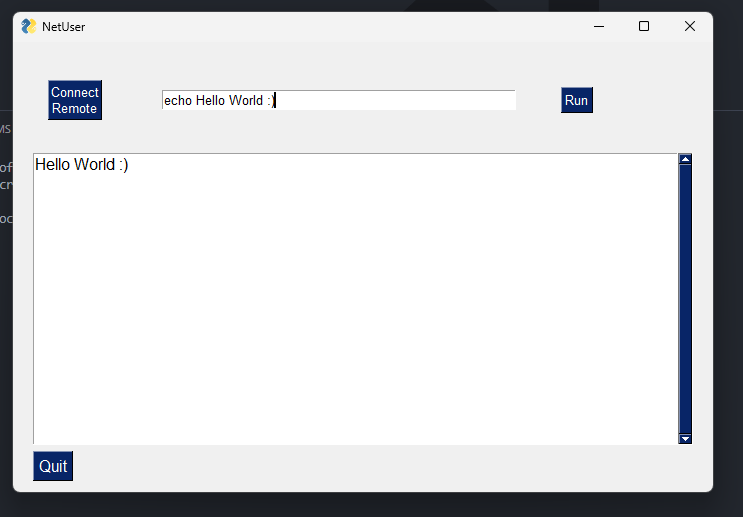

<div align="center">

# Remote Admin Tool - Efficient Local Network Command Execution

<p id="intro">This project is a remote admin tool that allows administrators to execute commands on systems connected to a local network. Leveraging Python's socket programming and the PySimpleGUI framework, this tool provides a simple and effective way to manage remote systems with ease.</p>

### Supported Platforms

[]()

---

<p>

<span>
  <a href="https://github.com/darsan-in/Remote-Admin-Tool/commits/main">
    
  </a>
</span>

<span>
  <a href="">
    
  </a>
</span>

</p>

---

<p>

<span>
  <a href="LICENSE">
    
  </a>
</span>

<span>
  <a href="https://github.com/darsan-in/Remote-Admin-Tool/releases">
    
  </a>
</span>

</p>

<p>

<span>
  <a href="https://www.codefactor.io/repository/github/darsan-in/Remote-Admin-Tool/issues/main">
    
  </a>
</span>

</p>

---

<p>

<span>
  <a href="">
    
  </a>
</span>

</p>

---

</div>

## Table of Contents 📝

- [Features and Benefits](#features-and-benefits-)
- [Use Cases](#use-cases-)
- [Friendly request to users](#-friendly-request-to-users)

- [Usage](#usage)
- [In-Action](#in-action-)

- [License](#license-%EF%B8%8F)
- [Contributing to Our Project](#contributing-to-our-project-)

- [Contact Information](#contact-information)

## Features and Benefits ✨

- **Remote Command Execution**: Execute commands on any system within the local network remotely.
- **Real-time Output**: View the output of executed commands instantly in the GUI's output window.
- **User-Friendly Interface**: Simple input and output windows designed with PySimpleGUI for an intuitive user experience.
- **Secure Socket Programming**: Reliable communication between systems using socket programming.
- **Cross-Platform Compatibility**: Works on various operating systems as long as Python is supported.
- **Lightweight and Fast**: Minimal resource usage, ensuring quick and efficient command execution.

## Use Cases ✅

- **Network Administration**: Manage multiple systems within a local network without physical access.
- **IT Support**: Troubleshoot and resolve issues on remote systems quickly.
- **Educational Purposes**: Learn and demonstrate the basics of socket programming and GUI development.
- **Small Business Operations**: Maintain and manage small office networks without the need for expensive software.
- **Remote System Monitoring**: Keep an eye on remote systems by executing monitoring commands regularly.

---

### 🙏🏻 Friendly Request to Users

Every star on this repository is a sign of encouragement, a vote of confidence, and a reminder that our work is making a difference. If this project has brought value to you, even in the smallest way, **please consider showing your support by giving it a star.** ⭐

_"Star" button located at the top-right of the page, near the repository name._

Your star isn’t just a digital icon—it’s a beacon that tells us we're on the right path, that our efforts are appreciated, and that this work matters. It fuels our passion and drives us to keep improving, building, and sharing.

If you believe in what we’re doing, **please share this project with others who might find it helpful.** Together, we can create something truly meaningful.

Thank you for being part of this journey. Your support means the world to us. 🌍💖

---

## Usage

- **Step 1:** Run `ClientCore.py` program on client side.

```bash
python ClientCore.py
```

- **Step 2:** Run admin program.
  ⚠️Private IP of client need to be updated in `GUI.py`
  ⚠️You don't need to change any if you `experiment` with you own system - means client and admin are same.

```bash
python GUI.py
```

- **Step 3:** Click on `Connect Remote` button.

- **Step 4:** Execute command of your need.

- **Step 5:** Output would be shown in window. If any error occured, that as well would be printed in output window.

## In-Action 🤺



## License ©️

This project is licensed under the [MIT](LICENSE).

## Contributing to Our Project 🤝

We’re always open to contributions and fixing issues—your help makes this project better for everyone.

If you encounter any errors or issues, please don’t hesitate to [raise an issue](../../issues/new). This ensures we can address problems quickly and improve the project.

For those who want to contribute, we kindly ask you to review our [Contribution Guidelines](CONTRIBUTING) before getting started. This helps ensure that all contributions align with the project's direction and comply with our existing [license](LICENSE).

We deeply appreciate everyone who contributes or raises issues—your efforts are crucial to building a stronger community. Together, we can create something truly impactful.

Thank you for being part of this journey!

## Contact Information

For any questions, please reach out via hello@darsan.in or [LinkedIn](https://www.linkedin.com/in/darsan-in/).

---

<p align="center">

<span>
<a href="https://www.linkedin.com/in/darsan-in/"></a>
</span>

<span>
  
</span>

<span>
<a href="https://www.youtube.com/@darsan-in"></a>
</span>

<span>
  
</span>

<span>
<a href="https://www.npmjs.com/~darsan.in"></a>
</span>

<span>
  
</span>

<span>
<a href="https://github.com/darsan-in"></a>
</span>

<span>
  
</span>

<span>
<a href="https://darsan.in/"></a>
</span>

<p>

---

#### Topics

<ul id="keywords">
<li>remote-admin</li>
<li>socket-programming</li>
<li>Python-GUI</li>
<li>PySimpleGUI</li>
<li>network-management</li>
<li>command-execution</li>
<li>IT-support-tool</li>
<li>cross-platform</li>
<li>local-network</li>
<li>remote-commands</li>
</ul>
